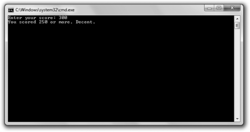

[Docs](../../../) / [Chapter2](../../) / [ScoreRater](../)
# Introducing the Score Rater 3.0 Program



The Score Rater 3.0 program also rates a score, which the user enters. But this time, the program uses a sequence of `if` statements with `else` clauses. Figure 2.4 shows the results of the program.

## Creating a Sequence of if Statements with else Clauses

You’ve seen the first part of this sequence twice already, and it works just the same this time around. If `score` is greater than or equal to 1000, the message, “You scored 1000 or more. Impressive!” is displayed and the computer branches to the `return` statement.

```cpp
if (score >= 1000)
```

However, if the expression if `false`, then we know that `score` is less than 1000 and the computer evaluates the next expression in the sequence:

```cpp
else if (score >= 500)
```

If `score` is greater than or equal to 500, the message, "You scored 500 or more. Nice." is displayed and the computer branches to the `return` statement. However, if that expression is `false`, then we know that `score` is less than 500 and the computer evalutes the next expression in the squence:

```cpp
else if (score >= 250)
```

If `score` is greater than or equal to 250, the message, "You scored 250 or more. Decent." is displayed and the computer branches to the `return` statement. However, if that expression is `false`, then we know that `score` is less than 250 and the statment associated with the final `else` clause is executed and the message, "You scored less than 250. Nothing to brag about." is displayed.

### Hint 
> While the final `else` clause in an `if else-if` suite isn't required, you can use it as a way to execute code if none of the expressions in the squence are true.

## Using the switch Statement

You can use a `switch` statement to create multiple branching points in your code. Here's a generic form of the `switch` statmement:

```cpp
switch(choice)
{
case value1:    statement 1;
                break;
case value2:    statement 2;
                break;
case value3:    statement 3;
                break;
...
case valueN:    statmentN;
                break;
default:        statmentN+1;
}
```

The statement test `choice` against the possible values—`value1`, `value2`, and `value3`-in order. If `choice` is equal to a value, then the program executes the corresponding `statement`. When the program hits a `break` statement, it exits the `switch` structure. If `choice` doesn't match any value, then the statement associated with the optional `default` is executed.

The use of `break` and `default` are optional. If you leave out a `break`, however, the program will continue through the remaining statements until it hits a `break` or a `default` or until the `switch` statement ends. Ususally you want one `break` statement to end each `case`.

### Hint
> Although a `default` case isn't required, it's ususally a good idea to have one as catchall.

Here's an example to cement the ideas. Suppose `choice` is equal to `value2`. The program will first test `choice` against `value1`. Because they're not equal, the program will continue. Next, the program will test `choice` against `value2`. Because they are equal, the program will execute `statement2`. Then the program will hit the `break` statement and exit the `switch` structure.

### Trap
> You can use the `switch` statement only to test an `int` (or value that can be treated as an `int`, such as a `char` or an `enumerator`). A `switch` statement won't work with any other type.

# Code
```cpp
// Score Rater 3.0
// Demonstrates the else-if else statement

#include <iostream>
using namespace std;

int main() {

	int score;
	cout << "Enter your score: ";
	cin >> score;

	if (score >= 1000) {
		cout << "You scored 1000 or more. Impressive!\n";
	}
	else if (score >= 500) {
		cout << "You scored 500 or more. Nice.\n";
	}
	else if (score >= 250) {
		cout << "You scored 250 or more. Decent.\n";
	}
	else {
		cout << "You scored less than 250. Nothing to brag about.\n";
	}

	return 0;
}
```

# Ouput

## Score < 250
```txt
Enter your score: 100
You scored less than 250. Nothing to brag about.
```

## Score >= 250
```txt
Enter your score: 251
You scored 250 or more. Decent.
```

## Score >= 500
```txt
Enter your score: 501
You scored 500 or more. Nice.
```

## Score >= 1000
```txt
Enter your score: 1001
You scored 1000 or more. Impressive!
```
