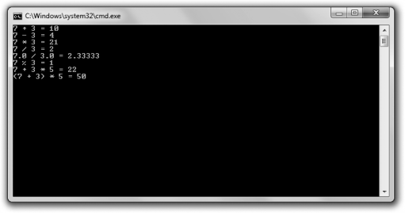

[Docs](../../) / [Chapter1](../)
# Introducing the Expensive Calculator Program



Most serious computer gamers invest heavily in a bleeding-edge, high-powered gaming rig. This next program, Expensive Calculator, can turn that monster of a machine into a simple calculator. The program demonstrates built-in arithmetic operators. Figure 1.4 shows off the results.

## Using Arithmetic Operators
Whether you’re tallying up the number of enemies killed or decreasing a player’s health level, you need your programs to do some math. As with other languages, C++ has built-in arithmetic operators.

## Adding, Subtracting, and Multiplying
I use the built-in arithmetic operators for addition (the plus sign, +), subtraction (the minus sign, -), and multiplication (an asterisk, *). The results depicted in Figure 1.4 are just what you’d expect.

Each arithmetic operator is part of an *expression*—something that evaluates to a single value. So, for example, the expression 7 + 3 evaluates to 10, and that’s what gets sent to `cout`.

## Understanding Integer and Floating Point Division
The symbol for division is the forward slash (/), so that’s what I use in the next line of code. However, the output might surprise you. According to C++ (and that expensive gaming rig), 7 divided by 3 is 2. What’s going on? Well, the result of any arithmetic calculation involving only *integers* (numbers without fractional parts) is always another integer. And since 7 and 3 are both integers, the result must be an integer. The fractional part of the result is thrown away.

To get a result that includes a fractional part, at least one of the values needs to be a *floating point* (a number with a fractional part). I demonstrate this in the next line with the expression 7.0 / 3.0. This time the result is a more accurate 2.33333.

### Trap
>You might notice that while the result of 7.0 / 3.0 (2.33333) includes a fractional part, it is still truncated. (The true result would stretch out 3s after the decimal point forever.) It’s important to know that computers generally store only a limited number of significant digits for floating point numbers. However, C++ offers categories of floating point numbers to meet the most demanding needs—even those of computationally intensive 3D games.

## Using the Modulus Operator
In the next statement, I use an operator that might be unfamiliar to you—the modulus operator (%). The modulus operator returns the remainder of integer division. In this case, 7 % 3 produces the remainder of 7 / 3, which is 1.

## Understanding Order of Operations
Just as in algebra, arithmetic expressions in C++ are evaluated from left to right. But some operators have a higher precedence than others and are evaluated first, regardless of position. Multiplication, division, and modulus have equal prece- dence, which is higher than the precedence level that addition and subtraction share.

The next line of code provides an example to help drive this home. Because multiplication has higher precedence than addition, you calculate the results of the multiplication first. So the expression 7 + 3 * 5 is equivalent to 7 + 15, which evaluates to 22.

If you want an operation with lower precedence to occur first, you can use parentheses, which have higher precedence than any arithmetic operator. So in the next statement, the expression (7 + 3) * 5 is equivalent to 10 * 5, which evaluates to 50.

### Hint
> For a list of C++ operators and their precedence levels, see Appendix B.

# Code
```cpp
// Expensive Calculator
// Demostrates built-in arithmetic operators

#include <iostream>
using namespace std;

int main()
{
	cout << "7 + 3 = " << 7 + 3 << endl;
	cout << "7 - 3 = " << 7 - 3 << endl;
	cout << "7 * 3 = " << 7 * 3 << endl;

	cout << "7 / 3 = " << 7 / 3 << endl;
	cout << "7.0 / 3.0 = " << 7.0 / 3.0 << endl;
	
	cout << "7 % 3 = " << 7 % 3 << endl;
	
	cout << "7 + 3 * 5 = " << 7 + 3 * 5 << endl;
	cout << "(7 + 3) * 5 = " << (7 + 3) * 5 << endl;

	return 0;
}

```

# Output
```txt
7 + 3 = 10
7 - 3 = 4
7 * 3 = 21
7 / 3 = 2
7.0 / 3.0 = 2.33333
7 % 3 = 1
7 + 3 * 5 = 22
(7 + 3) * 5 = 50
```